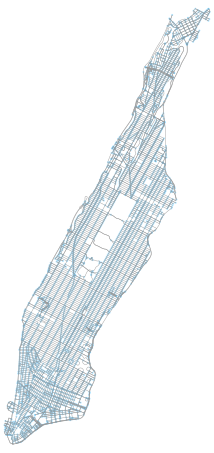

[](https://badge.fury.io/py/osmnx)
[](https://badge.fury.io/py/osmnx)
[](https://anaconda.org/conda-forge/osmnx)
[](https://osmnx.readthedocs.io/)
[](https://travis-ci.org/gboeing/osmnx)
[](https://coveralls.io/github/gboeing/osmnx?branch=master)


# OSMnx

**Python for street networks**

Retrieve, model, analyze, and visualize street networks from OpenStreetMap:
[full overview](https://geoffboeing.com/2016/11/osmnx-python-street-networks/).

**Citation info**: Boeing, G. 2017. "[OSMnx: New Methods for Acquiring, Constructing, Analyzing, and Visualizing Complex Street Networks](https://geoffboeing.com/publications/osmnx-complex-street-networks/)." *Computers, Environment and Urban Systems* 65, 126-139. doi:10.1016/j.compenvurbsys.2017.05.004

## Overview

**OSMnx** is a Python package that lets you download spatial geometries and
model, project, visualize, and analyze street networks from OpenStreetMap's
APIs. Users can download and model walkable, drivable, or bikable urban
networks with a single line of Python code, and then easily analyze and
visualize them:

```python
import osmnx as ox
G = ox.graph_from_place('Manhattan Island, New York City, New York, USA', network_type='drive')
ox.plot_graph(G)
```


In a couple lines of code you can examine intersection density, network
circuity, average block size, PageRank, betweenness centrality, connectivity,
spatial distribution of dead-ends or 4-way intersections, etc for anywhere in
the world:

```python
basic_stats = ox.basic_stats(G)
print(basic_stats['circuity_avg'])

extended_stats = ox.extended_stats(G)
print(extended_stats['pagerank_max_node'])
```

You can just as easily download and work with building footprints, elevation
data, street bearings/orientations, and network routing.

## Installation

If you have any trouble with the installation, read the [docs](https://osmnx.readthedocs.io/).

You can install OSMnx with [conda](https://anaconda.org/conda-forge/osmnx):

```
conda install -c conda-forge osmnx
```

Alternatively, you can run OSMnx + Jupyter directly from this
[docker container](https://hub.docker.com/r/gboeing/osmnx), or you can install
OSMnx via [pip](https://pypi.python.org/pypi/OSMnx) if you already have OSMnx's
dependencies installed on your system: `pip install osmnx`

## Features

OSMnx is built on top of geopandas, networkx, and matplotlib and works with
OpenStreetMap's APIs to:

  * Download street networks anywhere in the world with a single line of code
  * Download other infrastructure network types, place polygons, building footprints, and points of interest
  * Download by city name, polygon, bounding box, or point/address + network distance
  * Download drivable, walkable, bikeable, or all street networks
  * Load street network from a local .osm file
  * Visualize street network as a static image or interactive leaflet web map
  * Simplify and correct the network's topology to clean and consolidate intersections
  * Save networks to disk as shapefiles or GraphML
  * Conduct topological and spatial analyses to automatically calculate dozens of indicators
  * Calculate and plot shortest-path routes as a static image or leaflet web map
  * Fast map-matching of points, routes, or trajectories to nearest graph edges or nodes
  * Plot figure-ground diagrams of street networks and/or building footprints
  * Download node elevations and calculate edge grades
  * Visualize travel distance and travel time with isoline and isochrone maps
  * Calculate and visualize street bearings and orientations

Examples and demonstrations of these features are in the
[examples repo](https://github.com/gboeing/osmnx-examples).
More feature development details are in the change log.

## Documentation

Documentation available at [readthedocs](https://osmnx.readthedocs.io).

Examples available in the [examples repo](https://github.com/gboeing/osmnx-examples).

## How to use OSMnx

For a quick demo overview of OSMnx, see this [demo notebook](https://github.com/gboeing/osmnx-examples/blob/master/notebooks/01-overview-osmnx.ipynb).

### Create place boundary shapefiles from OpenStreetMap

OSMnx lets you download spatial "place boundary" geometries from OpenStreetMap
(for cities, counties, states, countries, boroughs, etc.), save them to
shapefiles, project them, and plot them. For example, to retrieve, construct,
and save a shapefile of Berkeley's administrative boundaries:

```python
city = ox.gdf_from_place('Berkeley, California')
ox.save_gdf_shapefile(city)
```

For a more in-depth demonstration of creating these shapefiles, see [this notebook](https://github.com/gboeing/osmnx-examples/blob/master/notebooks/02-example-osm-to-shapefile.ipynb).

### Download and model street networks

OSMnx lets you download street network data and build topologically corrected street networks, project to UTM and plot the
networks, and save the street network as SVGs, GraphML files, or shapefiles for later use. The street networks are
directed and preserve one-way directionality. API responses are cached locally so OSMnx doesn't have to request the same
data from the API multiple times, saving bandwidth and increasing speed.

You can download a street network by providing OSMnx any of the following (demonstrated in the examples below):
  - a bounding box
  - a lat-long point plus a distance (either distance along the network, or cardinal)
  - an address plus a distance (either distance along the network, or cardinal)
  - a place name or list of place names (for OSMnx to automatically geocode and get the boundary of)
  - a polygon of the desired street network's boundaries

You can also specify several different network types:
  - `drive` - get drivable public streets (but not service roads)
  - `drive_service` - get drivable streets, including service roads
  - `walk` - get all streets and paths that pedestrians can use (this network type ignores one-way directionality)
  - `bike` - get all streets and paths that cyclists can use
  - `all` - download all non-private OSM streets and paths
  - `all_private` - download all OSM streets and paths, including private-access ones

For example, to download, model, project, and plot Manhattan's drivable street network:

```python
G = ox.graph_from_place('Manhattan, New York, USA', network_type='drive')
ox.plot_graph(ox.project_graph(G))
```

For an in-depth demonstration of creating street networks, see [this notebook](https://github.com/gboeing/osmnx-examples/blob/master/notebooks/03-example-osm-place-network.ipynb).

### Correct and simplify street network topology

Simplification is normally done by OSMnx automatically under the hood, but we can break it out to see how it works.
OpenStreetMap nodes include intersections, but they also include all the points along a single block where
the street curves. The latter are not nodes in the graph theory sense, so we remove them algorithmically and consolidate the
set of edges between "true" network nodes into a single edge, but retain the actual spatial geometry. There are two
simplification modes, strict and non-strict. The main difference is that unlike strict mode, non-strict mode allows
simplification to an *expansion graph*.

For an in-depth demonstration of topological simplification with OSMnx, see [this notebook](https://github.com/gboeing/osmnx-examples/blob/master/notebooks/04-example-simplify-network.ipynb).

### Save street networks to disk

OSMnx allows users to save street networks to disk as shapefiles to work with in GIS software, as GraphML files
to work with in Gephi or NetworkX, and as SVG files to work with in Illustrator. It also allows you to save place
boundary geometries as shapefiles.

For examples of saving and loading networks to/from disk, see [this notebook](https://github.com/gboeing/osmnx-examples/blob/master/notebooks/05-example-save-load-networks-shapes.ipynb).

### Analyze and visualize street networks

OSMnx allows you to calculate origin-destination routes along the network and quickly visualize them. You can easily
visualize elevation, street grade, one-way streets, cul de sacs, high/low connectivity intersections, building footprints,
etc. OSMnx provides built-in capabilities to quickly calculate spatial network metrics like intersection density, average
intersection degree, edge density, average street segment length, clustering coefficients, betweenness centrality, etc.

For examples of analyzing street networks with OSMnx, see [this notebook](https://github.com/gboeing/osmnx-examples/blob/master/notebooks/06-example-osmnx-networkx.ipynb).

## More info

For a more complete overview of [OSMnx, read this](https://geoffboeing.com/2016/11/osmnx-python-street-networks/).

Download/cite the [journal article here](https://geoffboeing.com/publications/osmnx-complex-street-networks/).

For more examples, see the [examples repo](https://github.com/gboeing/osmnx-examples).
