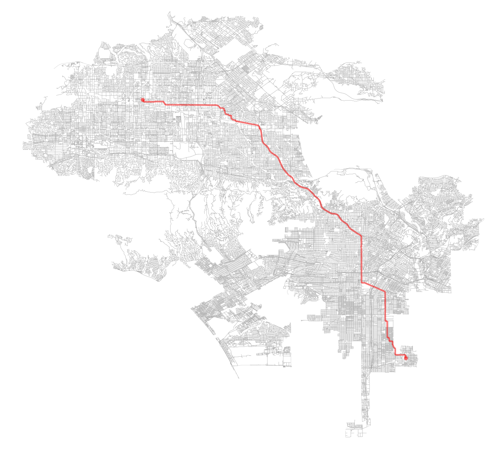
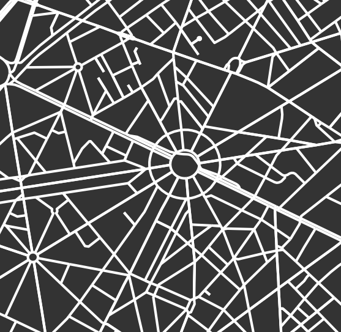

# Summary

OSMnx is a Python package for downloading OpenStreetMap street network data and then constructing 
it into NetworkX graphs. OSMnx can simplify and correct the network's 
topology automatically to ensure that nodes actually exclusively represent intersections and 
dead-ends. Once the network is constructed and corrected, OSMnx can calculate shortest paths from 
one node to another. It can also calculate various network measures relevant to urban design and 
transportation (Ewing and Cervero 2010) as well as statistical physics (Newman 2010; Barthélemy 2011), 
including intersection density, average intersection degree, edge density, average street segment 
length, circuity (Giacomin and Levinson 2015), clustering coefficients, betweenness centrality 
(Crucitti et al. 2006), closeness centrality, PageRank (Brin and Page 1998), and many more. Its built-in
visualization capabilities leverage matplotlib to easily plot routes (Figure 1), one-way streets, 
dead-ends, high/low connectivity intersections, and figure-ground diagrams of street networks and 
urban form (Figure 2).

OpenStreetMap presents an important new source of geospatial network data (Jokar Arsanjani 2015; 
Karduni et al. 2016). This package makes it easy to work with OpenStreetMap data for urban planning, 
transportation engineering, and network analysis purposes. Although scholars in urban studies and 
physics have studied street networks in numerous ways, the existing software landscape limits 
researchers' capabilities. The labor-intensive challenge of compiling street network data sets, 
especially for multiple countries, tends to limit sample sizes and most studies fall back on planar 
representations of the graph for tractibility (e.g., Porta et al. 2006; Strano et al. 2013). There 
is currently no ideal tool that offers a consistent, scalable, configurable method for collecting 
street network data from anywhere in the world and assembling it into graph-theoretic objects (rather 
than simple spatial geometries).

OSMnx facilitates all of these use cases. It automates the downloading and algorithmic correction of 
street network and building footprint data for anywhere in the world from OpenStreetMap. It allows 
researchers to save street networks as ESRI shapefiles, GraphML files, or scalable vector graphics 
(SVG) files. Finally, it calculates routes and various network statistics, and projects and visualizes 
networks. Unlike expensive commercial software like ArcGIS and its limited network analysis capabilities, 
OSMnx is free, open-source, and natively provides rich network analysis abilities. Unlike network analysis 
software like Gephi, OSMnx natively provides geospatial abilities and interacts directly with 
OpenStreetMap's Nominatim and Overpass APIs. OSMnx leverages the geopandas, NetworkX, and matplotlib 
Python packages for geospatial analysis, network analysis, and the visualization of network statistics 
and built environment characteristics.

The latest stable release of the software can be installed via `pip` and full documentation can be found 
at https://osmnx.readthedocs.io.

*Figure 1. OSMnx retrieves the street network for Los Angeles, California and plots a shortest-path route along it.*

*Figure 2. OSMnx visualizes street networks in various ways to facilitate consistent comparison of urban form.*

# References
